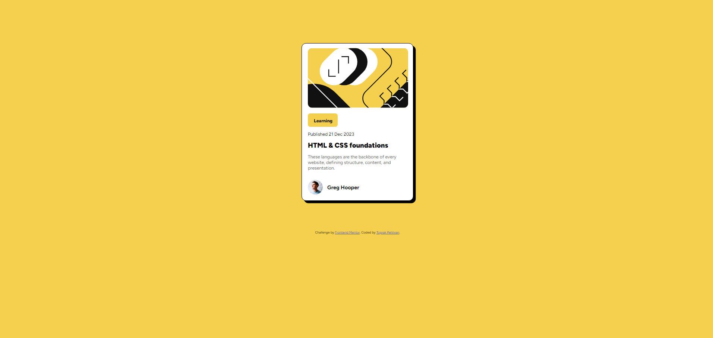

# Frontend Mentor - Blog preview card solution

This is a solution to the [Blog preview card challenge on Frontend Mentor](https://www.frontendmentor.io/challenges/blog-preview-card-ckPaj01IcS). Frontend Mentor challenges help you improve your coding skills by building realistic projects. 

## Table of contents

- [Overview](#overview)
  - [The challenge](#the-challenge)
  - [Screenshot](#screenshot)
  - [Links](#links)
- [My process](#my-process)
  - [Built with](#built-with)
  - [What I learned](#what-i-learned)
  - [Continued development](#continued-development)
  - [Useful resources](#useful-resources)
- [Author](#author)

### The challenge

Users should be able to:

- See hover and focus states for all interactive elements on the page

### Screenshot

### Links

- Solution URL: [Add solution URL here](https://github.com/ToprakPehleeone/blog-preview-card-project)
- Live Site URL: [Add live site URL here](https://toprakpehleeone.github.io/blog-preview-card-project/)

## My process

### Built with

- Semantic HTML5 markup
- CSS custom properties
- Flexbox

### What I learned

I have imrpoved on using margin and padding properities effectifely. Building a responsive tex-size without using media queries was a bit challenging. So i have done some research, and found the calc() function on CSS. I took some time trying different configurations to find the best values that suited my project. 

The code i used is below;

font-size: calc(0.6rem + 0.5vmin);

I have learned that to make responsive text-sizing i should not use 'px' values. Instead using 'rem' and 'em' values makes it more adaptive and responsive for various devices. 

### Continued development

Getting used to designing and using Semantic HTML feels satisfiyng. I want to improve as much as i can to write cleaner and more adaptive code.

### Useful resources

- [Example resource 1](https://stackoverflow.com/questions/19917578/text-automatically-resizes-without-media-queries-responsive-design) - This helped me for adaptive text-sizing solution.
- [Example resource 2](https://dev.to/vulcanwm/responsive-text-without-media-queries-4enc) - This is an amazing article which helped me finally understand text-sizing. I'd recommend it to anyone still learning this concept.

## Author

- Website - [Toprak Pehlivan](https://github.com/ToprakPehleeone)
- Frontend Mentor - [@ToprakPehleeone](https://www.frontendmentor.io/profile/ToprakPehleeone)
- Twitter - [@ToprakPehlivan](https://x.com/ToprakPehlivan)

